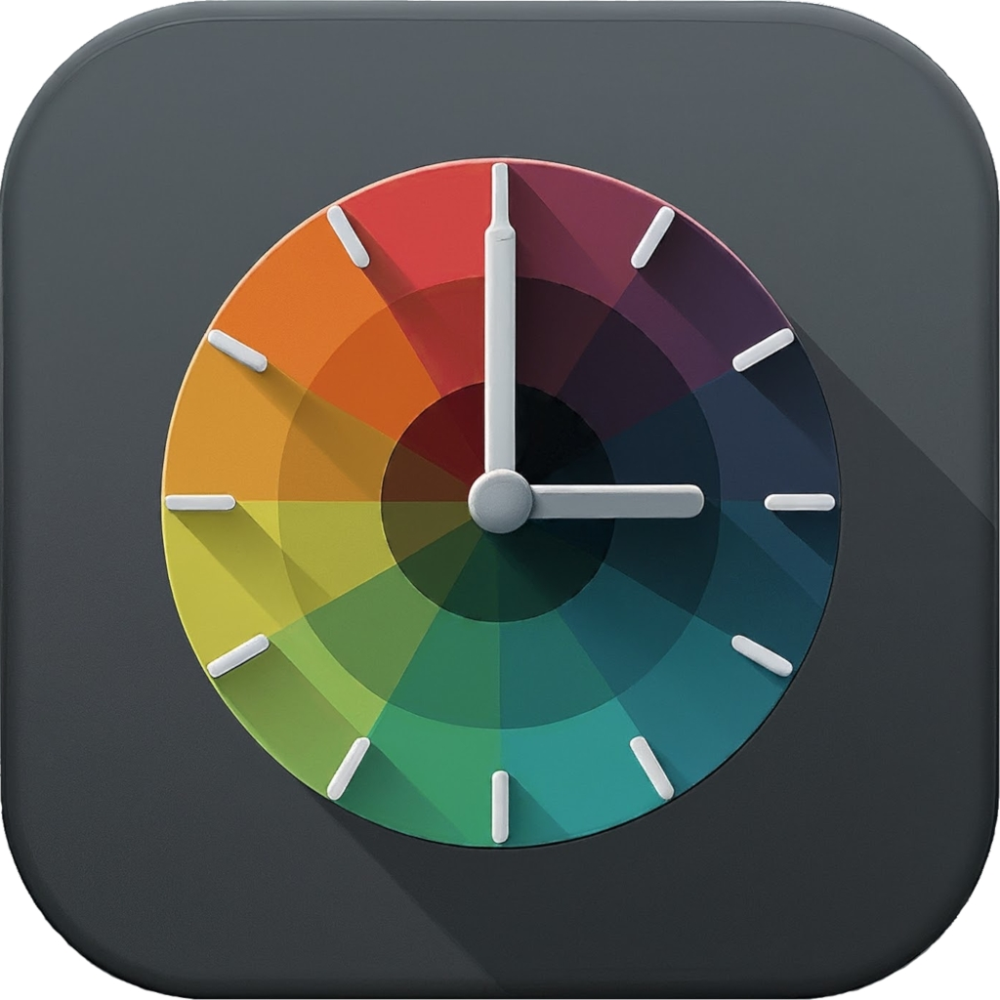

# Audamo
 

Audamo is a project designed to smoothly provide what fully featured desktop environments such as Gnome and KDE provide: An automated transition of your system theme between light and dark. This is particularly helpful for non-desktop environments such as i3wm, sway, hyprland, awesomewm, bspwm, dwm, and more. It can be configured to switch themes based on sunrise/sunset times or a specified schedule. Additionally, Audamo allows for the execution of custom scripts during theme changes, enabling users to personalize their experience.

</br>

## Installation

### Install Script

Install conveniently with the install script.

``` bash
bash <(curl -s -L https://raw.githubusercontent.com/braun-steven/audamo/main/install.sh)
```

### Arch Linux (AUR)

(TODO: Add to AUR)

```bash
paru -S audamo
```

## Enable Audamo

### Systemd

We provide systemd user units to run `audamo` as a service and timer. The service runs the `audamo` script and the timer triggers the service every 10 minutes.

```bash
systemctl --user enable --now audamo.service
systemctl --user enable --now audamo.timer
```

### Daemon Mode

If systemd is not available or not desired, `audamo` can also be run in daemon mode:

``` bash
audamo --daemon
```

## Configuration

``` toml
# Specify location by latitude and longitude
latitude = ""
longitude = ""

# Time in the format "%H:%M"
sunrise = "08:00"
sunset = "20:00"

# Theme mode:
#  - "location": sets the theme based on sunrise/sunset at given location
#  - "time": sets the theme
mode = "location"


# GTK Themes for light and dark mode
gtk-theme-light = "Adwaita"
gtk-theme-dark = "Adwaita-dark"


# Custom script that also gets executed with a single argument which is either "light" or "dark"
# This script may contain user specified `sed` instructions to e.g. replace the vim theme like "sed -i s/colorscheme dark/colorscheme light/g ~/.vimrc" or similar
# Make sure that the script has a proper shebang, e.g. "#!/bin/sh" for shell scripts
custom-script-path = ""
```

## Custom Script

A custom script can get executed with every time `audamo` is run. The script path can be configured in `config.toml` with the  `custom-script-path` variable. The script is run with a single argument which is either "light" or "dark". This script may contain user specified `sed` instructions to e.g. replace the vim theme like `sed -i s/colorscheme dark/colorscheme light/g ~/.vimrc` or similar. Make sure that the script has a proper shebang, e.g. `#!/bin/sh` for shell scripts.

An example script can be found in [`example-custom-script.sh`](example-custom-script.sh):

```bash
#!/usr/bin/env sh

# This is an example custom script that can be set as `custom-script-path` in the config file.

if [ "$1" = "light" ]; then
    echo "Custom script called in light mode!"
elif [ "$1" = "dark" ]; then
    echo "Custom script called in dark mode!"
fi
```


## Uninstall

``` bash
bash <(curl -s -L https://raw.githubusercontent.com/braun-steven/audamo/main/uninstall.sh)
```
